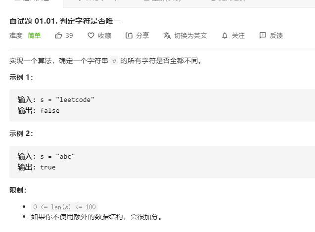

# 面试题01.01.判定字符是否唯一
  

```
/**
 * @param {string} astr
 * @return {boolean}
 */
var isUnique = function(astr) {
    let temp = [astr[0]];
    for(let i=1;i<astr.length;i++) {
        if(temp.indexOf(astr[i]) > -1) {
            return false;
        }
        temp.push(astr[i]);
    }

    return true;
};
```