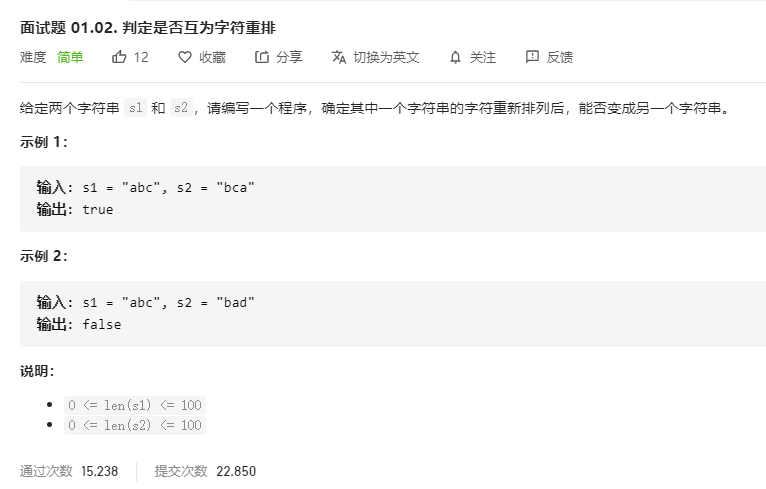

# 面试题01.02.判定是否互为字符重排
  

```
/**
 * @param {string} s1
 * @param {string} s2
 * @return {boolean}
 */
var CheckPermutation = function(s1, s2) {
    s1 = s1.split('').sort().join('');
    s2 = s2.split('').sort().join('');
    console.log(s1,s2);
    if(s1 == s2) {
        return true;
    }else {
        return false;
    }
};
```