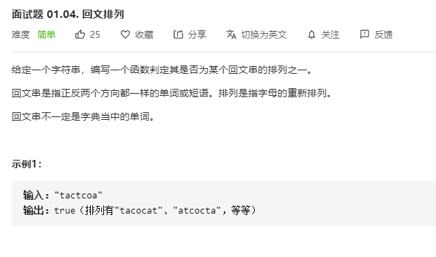

# 面试题01.04.回文排列
  

```
/**
 * @param {string} s
 * @return {boolean}
 */
var canPermutePalindrome = function(s) {
    s = s.split('');
    
    for(let i=0;i<s.length;i++) {
        if(s.indexOf(s[i]) != s.lastIndexOf(s[i])) {
            s.splice(s.lastIndexOf(s[i]), 1);
            s.splice(s.indexOf(s[i]), 1);
            i -= 2;
        }
    }

    console.log(s);

    if(s.length == 1 || s.length == 0) {
        return true;
    }else {
        return false;
    }
};
```