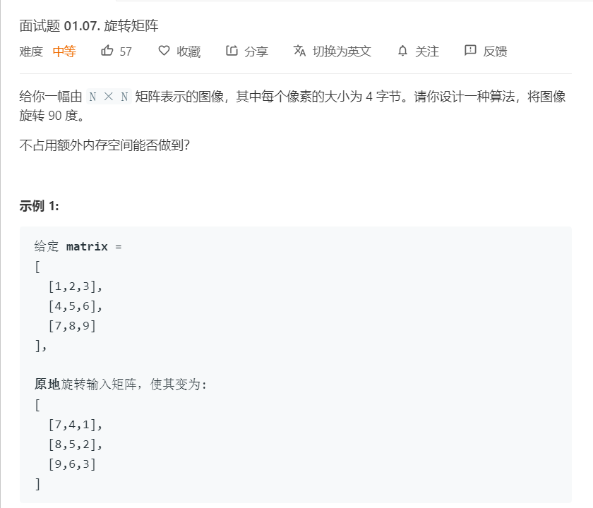

# 面试题01.07.旋转矩阵
  

```
/**
 * @param {number[][]} matrix
 * @return {void} Do not return anything, modify matrix in-place instead.
 */
var rotate = function(matrix) {
    let m = matrix.length,n = matrix[0].length;
    let result = new Array(m);
    for(let i=0;i<m;i++){
        result[i] = new Array(n);
    }

    for(let i=0;i<m;i++){
        for(let j=0;j<n;j++){
            result[j][m-1-i] = matrix[i][j];
        }
    }

    console.log(result);

    result.forEach((el,index) => {
        matrix[index] = el;
    })
    // return result;
};
```