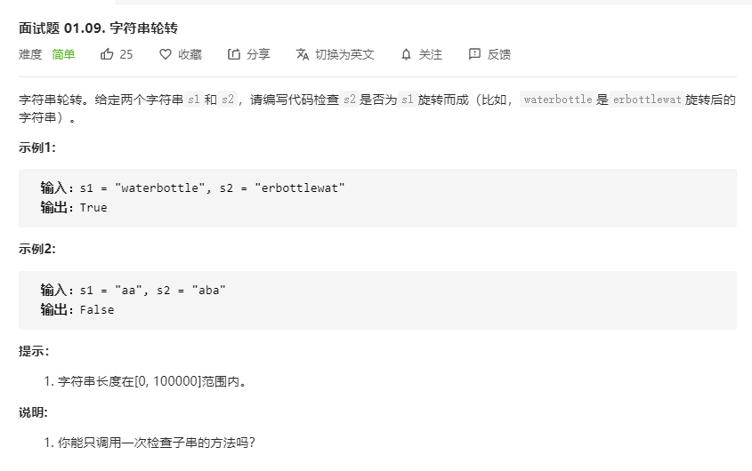

# 面试题01.09.字符串轮转
  

```
/**
 * @param {string} s1
 * @param {string} s2
 * @return {boolean}
 */
var isFlipedString = function(s1, s2) {
    s1 = s1.split('').sort().join('');
    s2 = s2.split('').sort().join('');

    if(s1 == s2) {
        return true;
    }else {
        return false;
    }
};
```