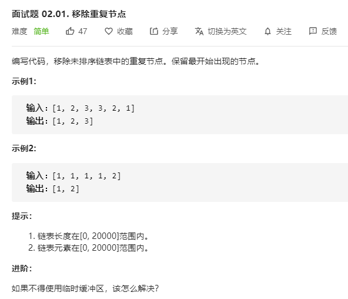

# 面试题02.01.移除重复节点
  

```
/**
 * Definition for singly-linked list.
 * function ListNode(val) {
 *     this.val = val;
 *     this.next = null;
 * }
 */
/**
 * @param {ListNode} head
 * @return {ListNode}
 */
var removeDuplicateNodes = function(head) {
    if(!head) {
        return head;
    }
    let temp = [head.val],myhead = head;
    while(head.next) {
        if(temp.indexOf(head.next.val) > -1) {
            head.next = head.next.next;
        }else {
            temp.push(head.next.val);
            head = head.next;
        }
    }

    return myhead;
};
```