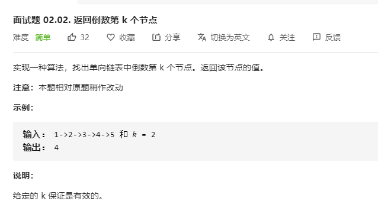

# 面试题02.02.返回倒数第k个节点
  

```
/**
 * Definition for singly-linked list.
 * function ListNode(val) {
 *     this.val = val;
 *     this.next = null;
 * }
 */
/**
 * @param {ListNode} head
 * @param {number} k
 * @return {number}
 */
var kthToLast = function(head, k) {
    let temp = [];

    while(head) {
        temp.push(head.val);
        head = head.next;
    }

    return temp[temp.length - k];
};
```  

```
/**
 * Definition for singly-linked list.
 * function ListNode(val) {
 *     this.val = val;
 *     this.next = null;
 * }
 */
/**
 * @param {ListNode} head
 * @param {number} k
 * @return {number}
 */
var kthToLast = function(head, k) {
    let fast = head,slow = head;

    while(k > 0) {
        fast = fast.next;
        k--;
    }

    while(fast) {
        fast = fast.next;
        slow = slow.next;
    }

    return slow.val;
};
```