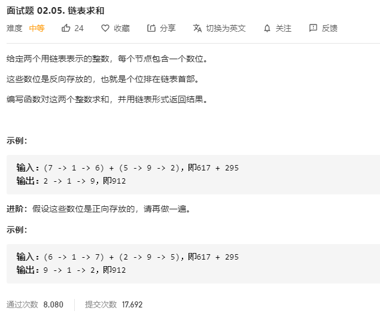

# 面试题02.05.链表求和
  

```
/**
 * Definition for singly-linked list.
 * function ListNode(val) {
 *     this.val = val;
 *     this.next = null;
 * }
 */
/**
 * @param {ListNode} l1
 * @param {ListNode} l2
 * @return {ListNode}
 */
var addTwoNumbers = function(l1, l2) {
    let one = [],two = [];
    while(l1) {
        one.unshift(l1.val);
        l1 = l1.next;
    }
    while(l2) {
        two.unshift(l2.val);
        l2 = l2.next;
    }
    console.log(one,two);
    let result = [], temp = 0;

    while(one.length > 0 && two.length > 0) {
        let now = (+one.pop() + (+two.pop()) + temp);
        console.log(now);
        if(now >= 10) {
            temp = 1;
            result.push(now - 10);
            if(one.length == 0 && two.length == 0) {
                result.push(1);
            }
        } else {
            temp = 0;
            result.push(now);
        }
    }

    while(one.length > 0) {
        let now = one.pop() + temp;
        if(now >= 10) {
            temp = 1;
            result.push(now - 10);
            if(one.length == 0) {
                result.push(1);
            }
        } else {
            temp = 0;
            result.push(now);
        }
    }

    while(two.length > 0) {
        let now = two.pop() + temp;
        if(now >= 10) {
            temp = 1;
            result.push(now - 10);
            if(two.length == 0) {
                result.push(1);
            }
        } else {
            temp = 0;
            result.push(now);
        }
    }

    console.log(result);

    let re = new ListNode(+result.shift());
    let rr = re;
    while(result.length > 0) {
        re.next = new ListNode(+result.shift());
        re = re.next;
    }

    console.log(re);
    return rr; 
};
```

```
var addTwoNumbers = function (l1, l2) {
    let carry = 0, root = new ListNode(null);
    let p = root;
    while (true) {
        let val = (l1 ? l1.val : 0) + (l2 ? l2.val : 0) + carry;
        //进位
        carry = Math.floor(val / 10);
        //值
        val = val % 10;
        /* 新结点赋值 */
        p.next = new ListNode(val);
        p = p.next;
        /* 判断l1,l2 */
        if (l1) l1 = l1.next;
        if (l2) l2 = l2.next;
        /* carry为0才能退出 */
        if (!l1 && !l2 && !carry)
            break;
    }
    return root.next;
};


```