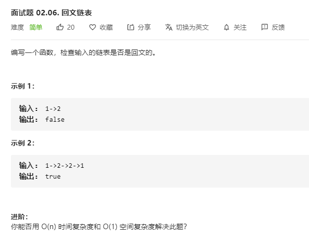

# 面试题02.06.回文链表
  

```
/**
 * Definition for singly-linked list.
 * function ListNode(val) {
 *     this.val = val;
 *     this.next = null;
 * }
 */
/**
 * @param {ListNode} head
 * @return {boolean}
 */
var isPalindrome = function(head) {
    let temp = [];
    while(head) {
        temp.push(head.val);
        head = head.next;
    }

    let mid = temp.length >> 1;
    let i = 0;
    while(i < mid) {
        if(temp[i] != temp[temp.length - 1 - i]) {
            return false;
        }
        i++;
    }

    return true;
};
```

```
/**
 * Definition for singly-linked list.
 * function ListNode(val) {
 *     this.val = val;
 *     this.next = null;
 * }
 */
/**
 * @param {ListNode} head
 * @return {boolean}
 */
var isPalindrome = function(head) {
    let one = '', two = '';

    while(head) {
        one = one + head.val;
        two = head.val + two;
        head = head.next;
    }

    if(one == two) {
        return true;
    }else {
        return false;
    }
};
```