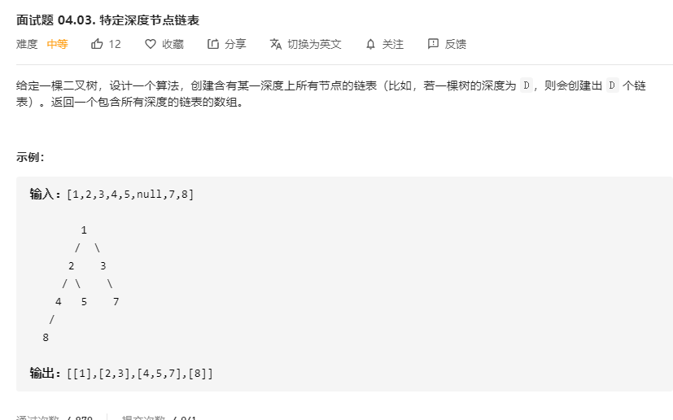

# 面试题04.03.特定深度节点链表
  

```
/**
 * Definition for a binary tree node.
 * function TreeNode(val) {
 *     this.val = val;
 *     this.left = this.right = null;
 * }
 */
/**
 * Definition for singly-linked list.
 * function ListNode(val) {
 *     this.val = val;
 *     this.next = null;
 * }
 */
/**
 * @param {TreeNode} tree
 * @return {ListNode[]}
 */


var listOfDepth = function(tree) {
    let res = [],head = [];
    const mid = (nowthree, who) => {
        if(!nowthree) {
            return ;
        }
        if(!res[who]) {
            let now = new ListNode(nowthree.val)
            head[who] = now;
            res.push(now);
        } else {
            let now = new ListNode(nowthree.val)
            head[who].next = now;
            head[who] = head[who].next;
        }

        mid(nowthree.left, who + 1);
        mid(nowthree.right, who + 1);
    }

    mid(tree, 0);

    console.log(res);
    return res
};
```