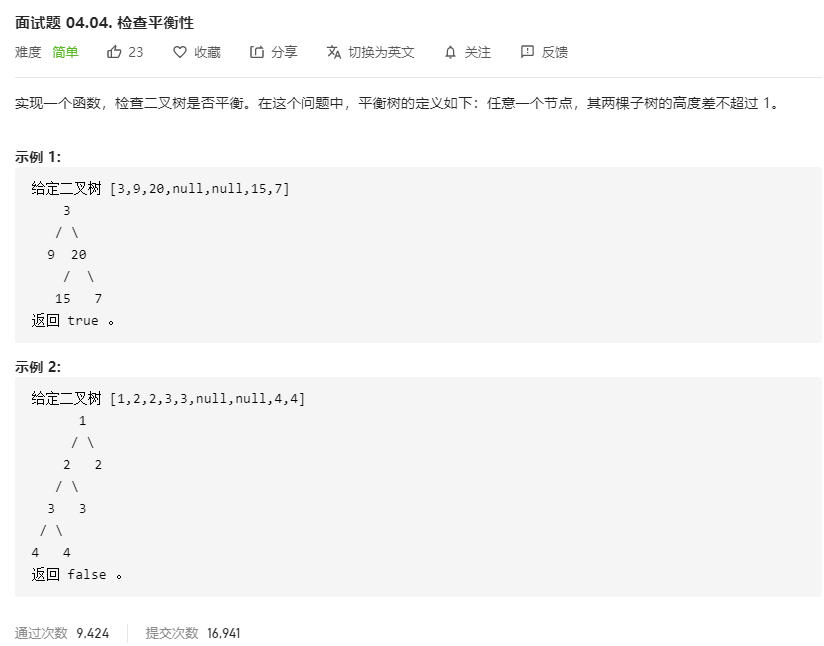

# 面试题04.04.检查平衡性
  

```
/**
 * Definition for a binary tree node.
 * function TreeNode(val) {
 *     this.val = val;
 *     this.left = this.right = null;
 * }
 */
/**
 * @param {TreeNode} root
 * @return {boolean}
 */
var isBalanced = function(root) {
    let result = true;
    const deth = (root) => {
        if(!root || !result) {
            return 0;
        }

        let left = deth(root.left);
        let right = deth(root.right);

        if(Math.abs(left-right) > 1) {
            result = false;
            return 0;
        }
    
        return Math.max(left, right) + 1;
    }

    deth(root);

    return result;
};
```