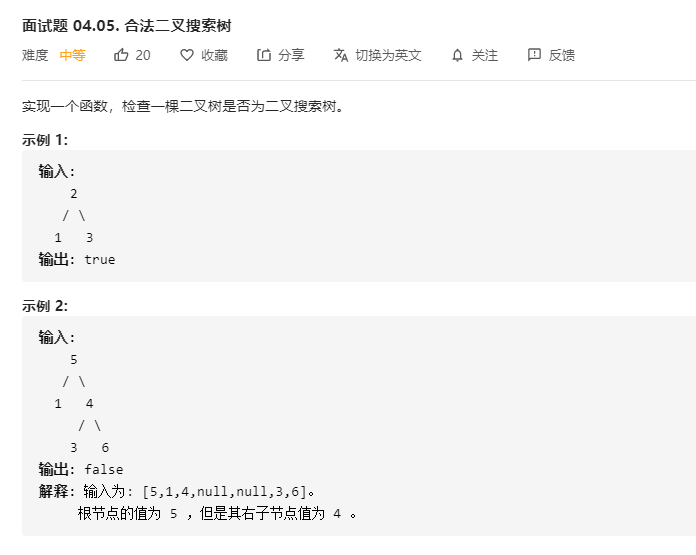

# 面试题04.05.合法二叉搜索树
  

```
/**
 * Definition for a binary tree node.
 * function TreeNode(val) {
 *     this.val = val;
 *     this.left = this.right = null;
 * }
 */
/**
 * @param {TreeNode} root
 * @return {boolean}
 */
var isValidBST = function(root) {
    const mid = (r, low, up) => {
        if(!r) {
            return true;
        }

        if(r.val <= low || r.val >= up) {
            return false;
        }

        return mid(r.left, low, r.val) && mid(r.right, r.val, up);
    }

    return mid(root, -Infinity, Infinity);
};
```

```
/**
 * Definition for a binary tree node.
 * function TreeNode(val) {
 *     this.val = val;
 *     this.left = this.right = null;
 * }
 */
/**
 * @param {TreeNode} root
 * @return {boolean}
 */
var isValidBST = function(root) {
    let temp = [];

    const mid = (r) => {
        if(r) {
            mid(r.left);
            temp.push(r.val);
            mid(r.right);
        }
    }

    mid(root);

    console.log(temp);

    let min = temp.shift();
    while(temp.length > 0) {
        let now = temp.shift();
        if(now <= min) {
            return false;
        }
        min = now;
    }

    return true;
};
```