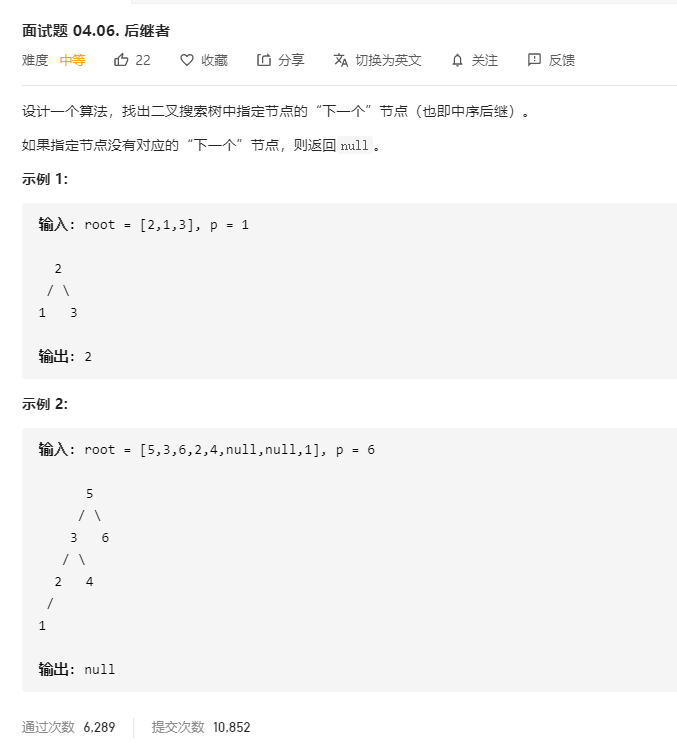

# 面试题04.06.后继者
  

```
/**
 * Definition for a binary tree node.
 * function TreeNode(val) {
 *     this.val = val;
 *     this.left = this.right = null;
 * }
 */
/**
 * @param {TreeNode} root
 * @param {TreeNode} p
 * @return {TreeNode}
 */
var inorderSuccessor = function(root, p) {
    let temp = [];
    const mid = (r) => {
        if(!r) {
            return;
        }

        mid(r.left);
        temp.push(r.val);
        mid(r.right);
    }

    mid(root);

    let res = temp.indexOf(p.val);

    console.log(temp, res, temp[res + 1]);

    return res + 1 < temp.length ? new TreeNode(temp[res + 1]) : null;
};
```