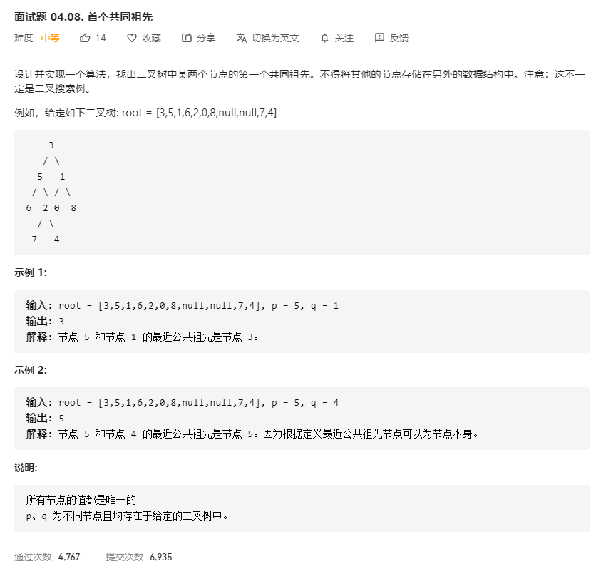

# 面试题04.08.首个共同祖先
  

```
/**
 * Definition for a binary tree node.
 * function TreeNode(val) {
 *     this.val = val;
 *     this.left = this.right = null;
 * }
 */
/**
 * @param {TreeNode} root
 * @param {TreeNode} p
 * @param {TreeNode} q
 * @return {TreeNode}
 */
var lowestCommonAncestor = function(root, p, q) {
    let temp = [];

    const mid = (r) => {
        if(r) {
            mid(r.left);
            temp.push(r.val);
            mid(r.right);
        }
    }

    mid(root);

    // console.log(temp, root.val);
    let rr;

    const res = (root) => {
        if(!root) {
            return;
        }
        let now = temp.indexOf(root.val);
        let one = temp.indexOf(p.val);
        let two = temp.indexOf(q.val);
        if(one < now && two < now) {
            res(root.left);
        } else if(one > now && two > now){
            res(root.right)
        } else {
            rr = root;
            return root;
        }
    }

    const need = res(root, temp);

    return rr;
};
```

```
/**
 * Definition for a binary tree node.
 * function TreeNode(val) {
 *     this.val = val;
 *     this.left = this.right = null;
 * }
 */
/**
 * @param {TreeNode} root
 * @param {TreeNode} p
 * @param {TreeNode} q
 * @return {TreeNode}
 */
var lowestCommonAncestor = function(root, p, q) {
    if(!root || root == p || root == q) {
        return root;
    }

    let left = lowestCommonAncestor(root.left, p, q);
    let right = lowestCommonAncestor(root.right, p, q);

    if(left && right) {
        return root;
    }

    return left ? left : right;
};
```