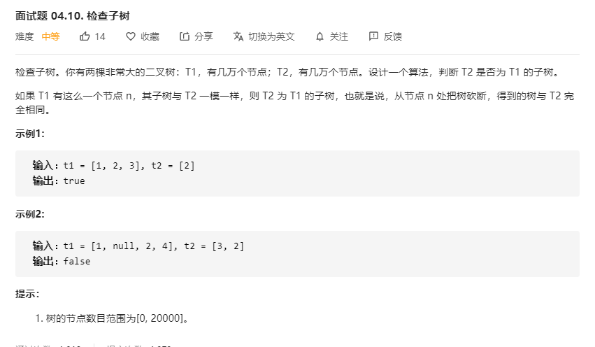

# 面试题04.10.检查子树
  

```
/**
 * Definition for a binary tree node.
 * function TreeNode(val) {
 *     this.val = val;
 *     this.left = this.right = null;
 * }
 */
/**
 * @param {TreeNode} t1
 * @param {TreeNode} t2
 * @return {boolean}
 */
var checkSubTree = function(t1, t2) {
    if(!t1) {
        return t2 === null;
    }

    return mid(t1, t2) || checkSubTree(t1.left, t2) || checkSubTree(t1.right, t2);
};

const mid = (one, two) => {
    if(!one && !two) {
        return true;
    }

    if(!one || !two) {
        return false;
    }

    return one.val === two.val && mid(one.left, two.left) && mid(one.right, two.right);
}
```