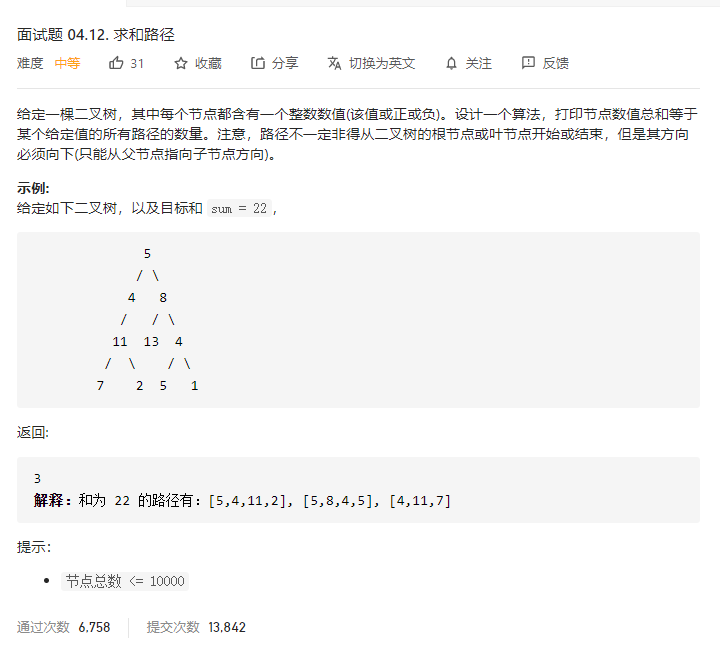

# 面试题04.12.求和路径
  

```
/**
 * Definition for a binary tree node.
 * function TreeNode(val) {
 *     this.val = val;
 *     this.left = this.right = null;
 * }
 */
/**
 * @param {TreeNode} root
 * @param {number} sum
 * @return {number}
 */
var pathSum = function(root, sum) {
    if (!root) {
        return 0;
    }

    const mid = (r, nownum) => {
        if (!r) return 0;
        if (r.val === nownum) return 1 + mid(r.left, nownum - r.val) + mid(r.right, nownum-r.val);
        return mid(r.left, nownum - r.val) + mid(r.right, nownum-r.val);
    }

    return mid(root, sum) + pathSum(root.left, sum) + pathSum(root.right, sum);
};
```