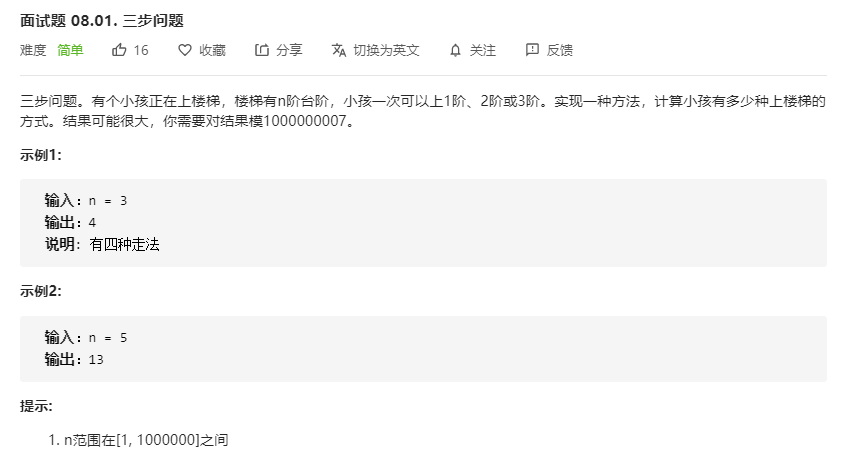

# 面试题08.01.三步问题
  

```
/**
 * @param {number} n
 * @return {number}
 */
var waysToStep = function(n) {
    let res = new Array(n);
    res[0] = 1;
    res[1] = 2;
    res[2] = 4;

    for(let i=3;i< n;i++) {
        let temp = res[i-1] + res[i-2] + res[i-3];
        res[i] = temp % 1000000007;
    }

    return res[n-1];
};
```