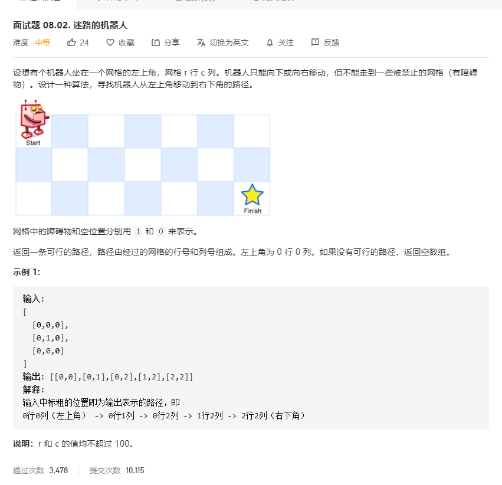

# 面试题08.02.迷路的机器人
  

```
/**
 * @param {number[][]} obstacleGrid
 * @return {number[][]}
 */
var pathWithObstacles = function(obstacleGrid) {
    if(!obstacleGrid || obstacleGrid.length === 0 || obstacleGrid[0].length === 0) {
        return [];
    }

    let res = [];
    let m = obstacleGrid.length, n = obstacleGrid[0].length;

    const mid = (temp, i, j) => {
        if(i >= m || j >= n || obstacleGrid[i][j] === 1 || res.length > 0) {
            return ;
        }

        if(i === m - 1 && j === n - 1) {
            temp.push([i, j]);
            res.push(temp);
            return ;
        }

        temp.push([i, j]);
        obstacleGrid[i][j] = 1;
        mid(temp.slice(), i + 1, j);
        mid(temp.slice(), i, j + 1);
    }

    mid([], 0, 0);

    return res.length > 0 ? res[0] : [];
};
```