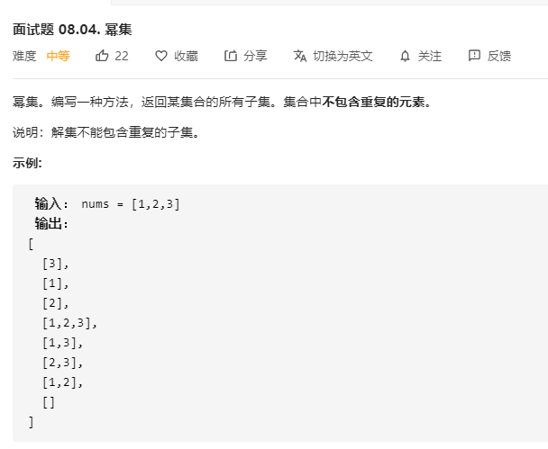

# 面试题08.04.幂集
  

```
/**
 * @param {number[]} nums
 * @return {number[][]}
 */
var subsets = function(nums) {
    let res = [[]];

    const mid = (now, temp) => {
        for(let i=0;i<nums.length;i++) {
            if(temp.indexOf(i) < 0 && (temp.length == 0 || i > temp[temp.length - 1])) {
                temp.push(i);
                now.push(nums[i]);
                res.push(now.slice());
                mid(now.slice(), temp.slice());
                temp.pop();
                now.pop();
            }
        }
    }

    mid([], []);

    return res;
};
```