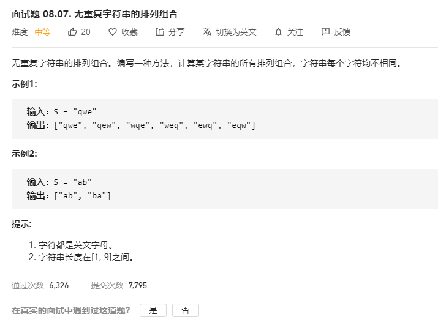

# 面试题08.07.无重复字符串的排列组合
  

```
/**
 * @param {string} S
 * @return {string[]}
 */
var permutation = function(S) {
    let res = [];

    S = S.split('');

    const mid = (temp) => {
        if(temp.length == S.length) {
            res.push(temp.join(''));
            return ;
        }
        for(let i=0;i<S.length;i++) {
            if(temp.indexOf(S[i]) < 0) {
                temp.push(S[i]);
                mid(temp.slice(''));
                temp.pop();
            }
        }
    }

    mid([]);

    console.log(res);
    return res;
};
```