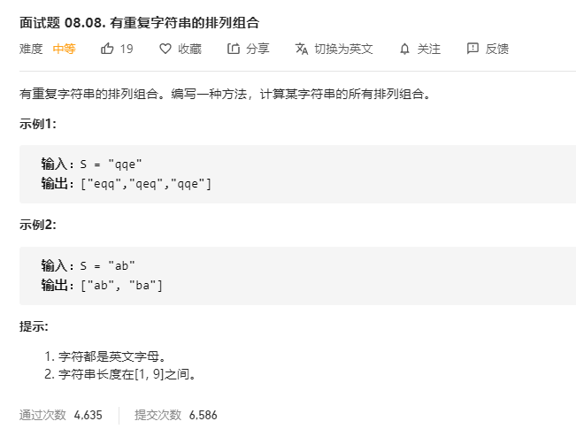

# 面试题08.08.有重复字符串的排列组合
  

```
/**
 * @param {string} S
 * @return {string[]}
 */
var permutation = function(S) {
    let res = [];
    const s = S.split('');

    const mid = (temp, who) => {
        if(temp.length == s.length) {
            if(res.indexOf(temp.join('')) < 0) {
                res.push(temp.join(''));
            }
            return;
        }

        for(let i=0;i<s.length;i++) {
            if(who.indexOf(i) < 0) {
                who.push(i);
                temp.push(s[i]);
                mid(temp.slice(), who.slice());
                who.pop();
                temp.pop();
            }
        }
    }

    mid([], []);

    return res;
};
```