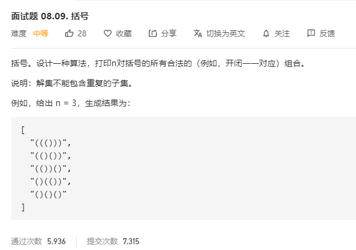

# 面试题08.09.括号
  

```
/**
 * @param {number} n
 * @return {string[]}
 */
var generateParenthesis = function(n) {
    let res = [];

    const mid = (temp, left, right) => {
        if(temp.length === n * 2) {
            res.push(temp.join(''));
            return;
        }

        if(left < n && left > right) {
            temp.push('(');
            mid(temp.slice(), left + 1, right);
            temp.pop();
            temp.push(")");
            mid(temp.slice(), left, right + 1);
        } else if(left < n && left <= right){
            temp.push('(');
            mid(temp.slice(), left + 1, right);
        } else if (right < n) {
            temp.push(")");
            mid(temp.slice(), left, right + 1);
        }
    }

    mid([], 0, 0);

    return res;
};
```