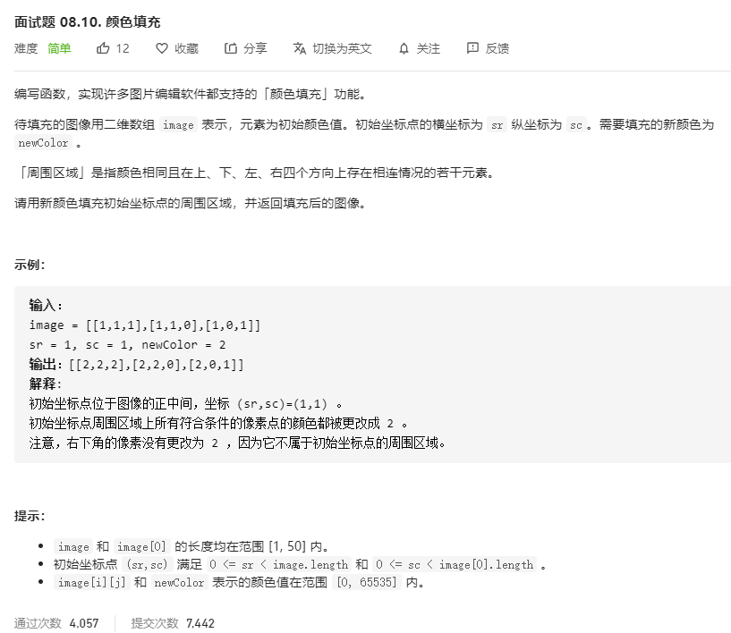

# 面试题08.10.颜色填充
  

```
/**
 * @param {number[][]} image
 * @param {number} sr
 * @param {number} sc
 * @param {number} newColor
 * @return {number[][]}
 */
var floodFill = function(image, sr, sc, newColor) {
    let m = image.length, n = image[0].length;

    let who = image[sr][sc];
    let can = new Array(m);
    for(let i = 0;i<can.length;i++) {
        can[i] = new Array(n).fill(1);
    }

    const mid = (one, two) => {
        image[one][two] = newColor;
        can[one][two] = 0;
        if(one-1 >=0 && image[one-1][two] == who && can[one-1][two] == 1) {
            mid(one-1, two);
        }
        if(one + 1 < m && image[one+1][two] == who && can[one+1][two] == 1) {
            mid(one+1, two);
        }
        if(two-1 >=0 && image[one][two-1] == who && can[one][two-1] == 1) {
            mid(one, two-1);
        }
        if(two + 1 < n && image[one][two+1] == who && can[one][two+1] == 1) {
            mid(one, two+1);
        }
    }

    mid(sr, sc);

    return image;
};
```