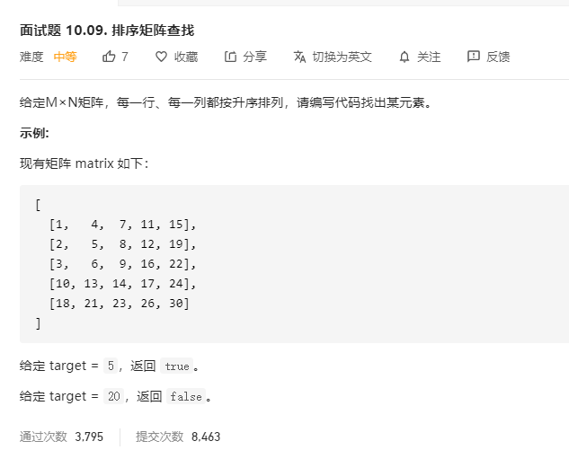

# 面试题10.09.排序矩阵查找
  

```
/**
 * @param {number[][]} matrix
 * @param {number} target
 * @return {boolean}
 */
var searchMatrix = function(matrix, target) {
    let res = false;

    if(!matrix || matrix.length == 0 || matrix[0] == 0) {
        return false;
    }

    let m = matrix.length, n = matrix[0].length;

    const mid = (i, j) => {
        if(i >= m || j >=n || matrix[i][j] === "*") {
            return ;
        }

        if(matrix[i][j] === target) {
            res = true;
        }

        matrix[i][j] = "*"
        mid(i + 1, j);
        mid(i, j + 1);
    }

    mid(0, 0);

    return res;
};
```