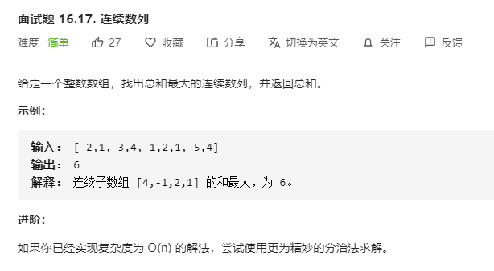

# 面试题16.17.连续数列
  

```
/**
 * @param {number[]} nums
 * @return {number}
 */
var maxSubArray = function(nums) {
    if(!nums || nums.length === 0) {
        return 0;
    }

    let res = new Array(nums.length).fill(0);

    res[0] = nums[0];

    for(let i=1;i< nums.length;i++) {
        res[i] = Math.max(res[i-1] + nums[i], nums[i]);
    }

    return Math.max(...res);
};
```