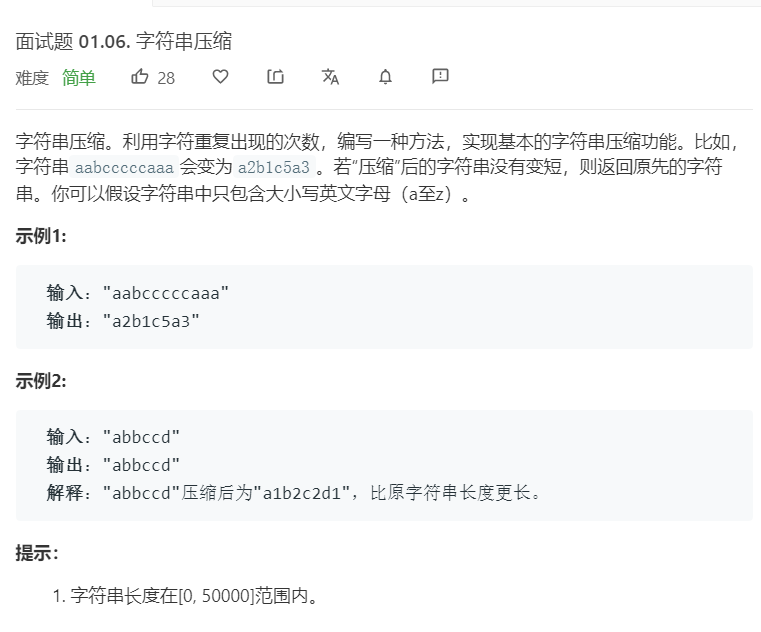

# 面试题01.06.字符串压缩
  

```
/**
 * @param {string} S
 * @return {string}
 */
var compressString = function(S) {
    let temp = [],result =[];
    S = S.split('');
    for(let i=0;i<S.length;i++){
        if(temp.length == 0 || temp[temp.length-1] == S[i]){
            temp.push(S[i]);
        }else{
            result.push(temp[0]);
            result.push(temp.length);
            temp = [];
            temp.push(S[i]);
        }

        if(i == S.length-1){
            result.push(temp[0]);
            result.push(temp.length);
        }
    }

    if(result.length < S.length){
        return result.join('');
    }else{
        return S.join('');
    }
};
```