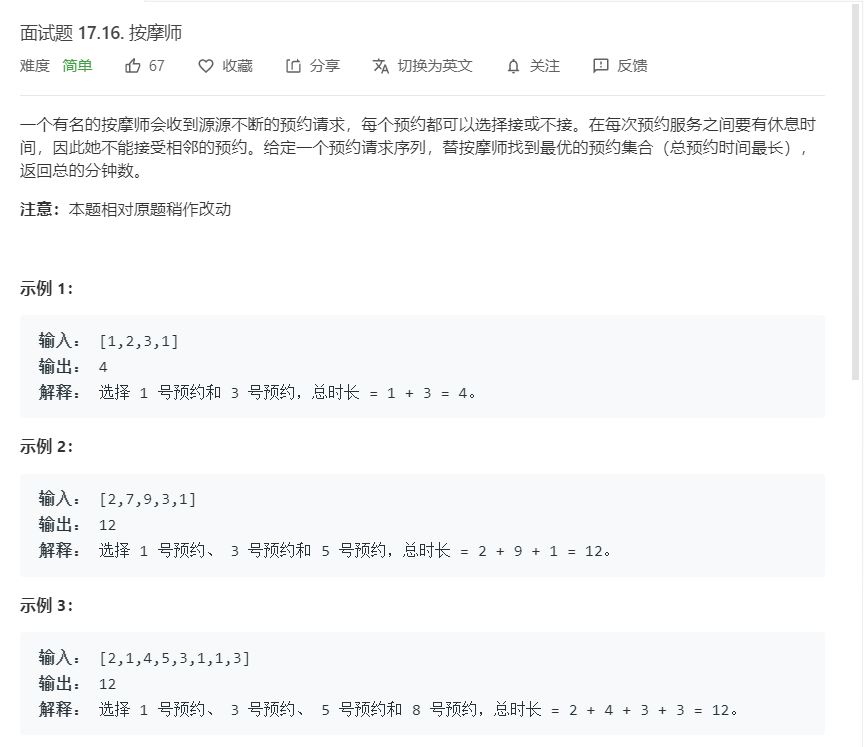

# 面试题17.16.按摩师
  

```
/**
 * @param {number[]} nums
 * @return {number}
 */
var massage = function(nums) {
    let n = nums.length;
    if(n <= 0){
        return 0;
    }

    let temp = new Array(n+1);
    temp[0] = 0;
    temp[1] = nums[0];

    for(let i=2;i<=n;i++){
        temp[i] = Math.max(temp[i-2]+nums[i-1],temp[i-1]);
    }

    return temp.pop();
};
```