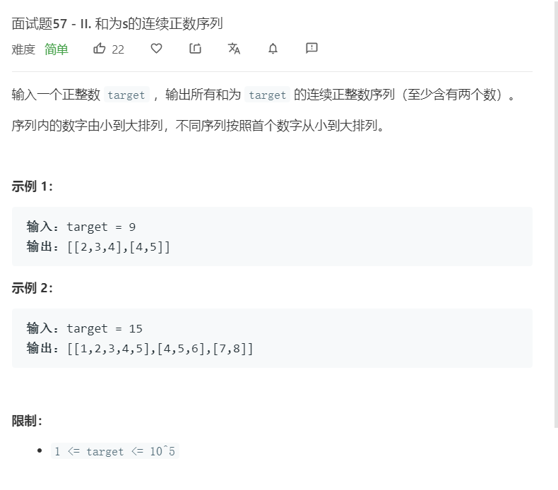

# 面试题57-II.和为s的连续正数序列
  

```
/**
 * @param {number} target
 * @return {number[][]}
 */
var findContinuousSequence = function(target) {
    let mid = target >> 1;
    mid += 2;
    let now = 0,temp = [], left = 1,right = 1,result = [];
    while(right <= mid){
        if(now < target){
            now += right;
            temp.push(right);
            // console.log(temp);
            right++;
        }else if(now > target){
            now -= left;
            left++;
            temp.shift();
            // console.log(temp);
        }else{
            console.log(temp);
            result.push(temp.slice());
            temp.push(right);
            now += right;
            right++;
        }
    }

    console.log(result)
    return result;
};
```