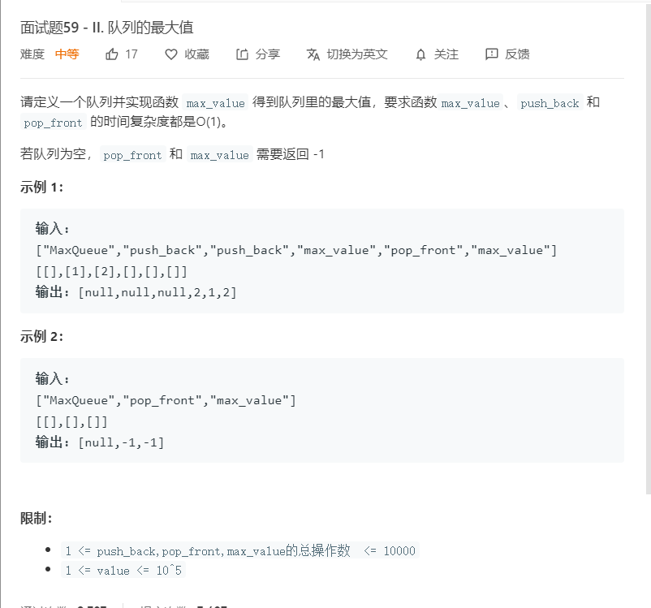

# 面试题59-II.队列的最大值
  

```
var MaxQueue = function() {
    this.temp = [];
};

/**
 * @return {number}
 */
MaxQueue.prototype.max_value = function() {
    if(this.temp.length > 0){
        let max = this.temp[0];
        this.temp.forEach((el)=>{
            if(el > max){
                max = el;
            }
        })
        return max;
    }else{
        return -1;
    }
};

/** 
 * @param {number} value
 * @return {void}
 */
MaxQueue.prototype.push_back = function(value) {
    this.temp = [...this.temp,value];
    console.log(this.temp)
};

/**
 * @return {number}
 */
MaxQueue.prototype.pop_front = function() {
    if(this.temp.length > 0){
        let popnumber = this.temp[0];
        this.temp.splice(0,1);
        return popnumber;
    }else{
        return -1;
    }
};

/**
 * Your MaxQueue object will be instantiated and called as such:
 * var obj = new MaxQueue()
 * var param_1 = obj.max_value()
 * obj.push_back(value)
 * var param_3 = obj.pop_front()
 */
```