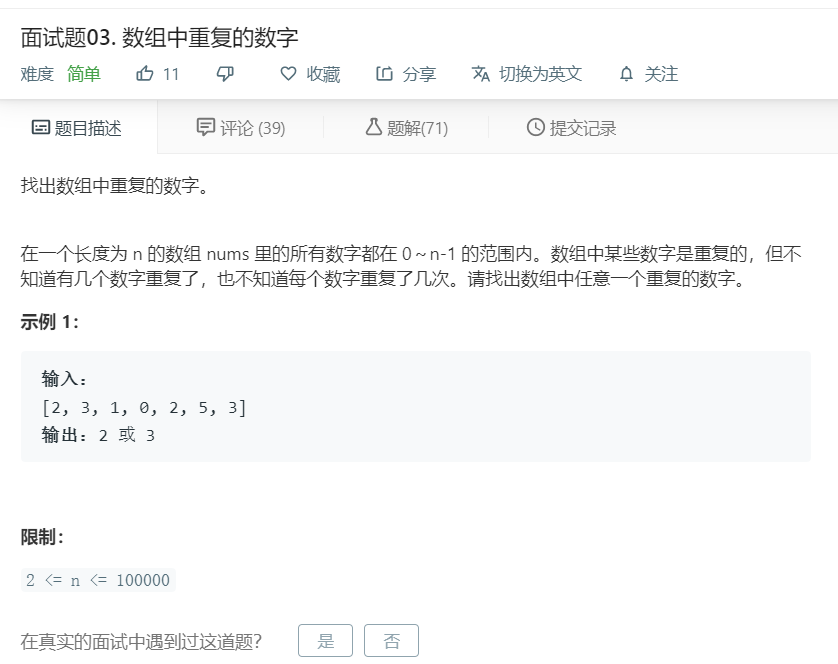

# 面试题03.数组中重复的数字
  

```
/**
 * @param {number[]} nums
 * @return {number}
 */
var findRepeatNumber = function(nums) {
    for(let i=0;i<nums.length;i++){
        if(nums.indexOf(nums[i]) != nums.lastIndexOf(nums[i])){
            return nums[i];
        }
    }
};
```