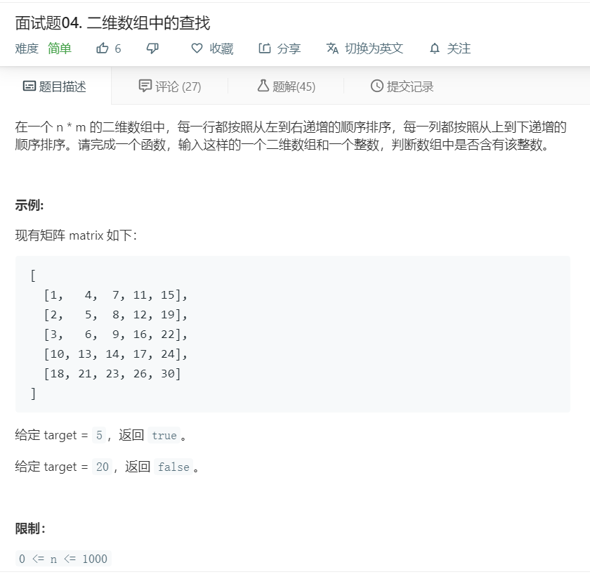

# 面试题04.二维数组中的查找
  

```
/**
 * @param {number[][]} matrix
 * @param {number} target
 * @return {boolean}
 */
var findNumberIn2DArray = function(matrix, target) {
    for(let i=0;i<matrix.length;i++){
        if(matrix[i].indexOf(target)>=0){
            return true;
        }
    }

    return false;
};
```