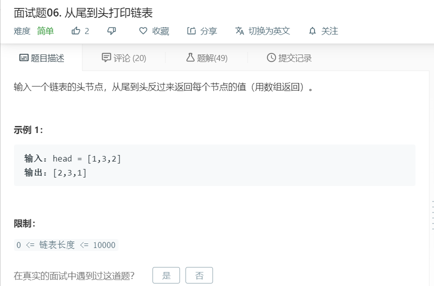

# 面试题06.从尾到头打印链表
  

```
/**
 * Definition for singly-linked list.
 * function ListNode(val) {
 *     this.val = val;
 *     this.next = null;
 * }
 */
/**
 * @param {ListNode} head
 * @return {number[]}
 */
var reversePrint = function(head) {
    let temp = [];
    while(head){
        temp.push(head.val);
        head = head.next;
    }

    return temp.reverse();
};
```