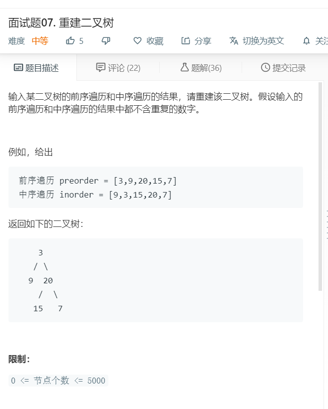

# 面试题07.重建二叉树
  

```
/**
 * Definition for a binary tree node.
 * function TreeNode(val) {
 *     this.val = val;
 *     this.left = this.right = null;
 * }
 */
/**
 * @param {number[]} preorder
 * @param {number[]} inorder
 * @return {TreeNode}
 */
var buildTree = function(preorder, inorder) {
    let zero = preorder[0];
    if(preorder.length == 0 || inorder.length == 0){
        return null;
    }
    let mid = inorder.indexOf(zero);

    let father = new TreeNode(zero);
    father.left = buildTree(preorder.slice(1,mid+1),inorder.slice(0,mid));
    father.right = buildTree(preorder.slice(mid+1),inorder.slice(mid+1));

    return father;
};
```