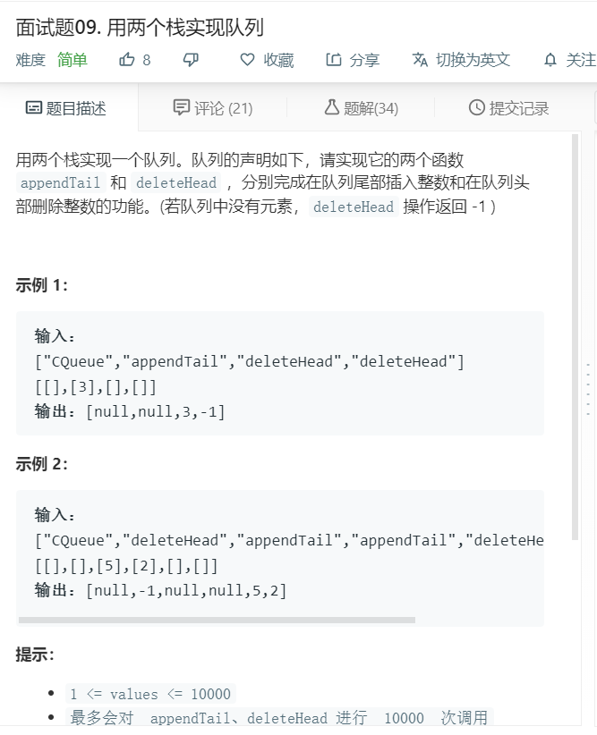

# 面试题09.用两个栈实现队列
  

```
var CQueue = function() {
    this.temp = [];
};

/** 
 * @param {number} value
 * @return {void}
 */
CQueue.prototype.appendTail = function(value) {
    this.temp.push(value);
};

/**
 * @return {number}
 */
CQueue.prototype.deleteHead = function() {
    if(this.temp.length == 0){
        return -1;
    }else{
        return this.temp.shift();
    }
};

/** 
 * Your CQueue object will be instantiated and called as such:
 * var obj = new CQueue()
 * obj.appendTail(value)
 * var param_2 = obj.deleteHead()
 */
```