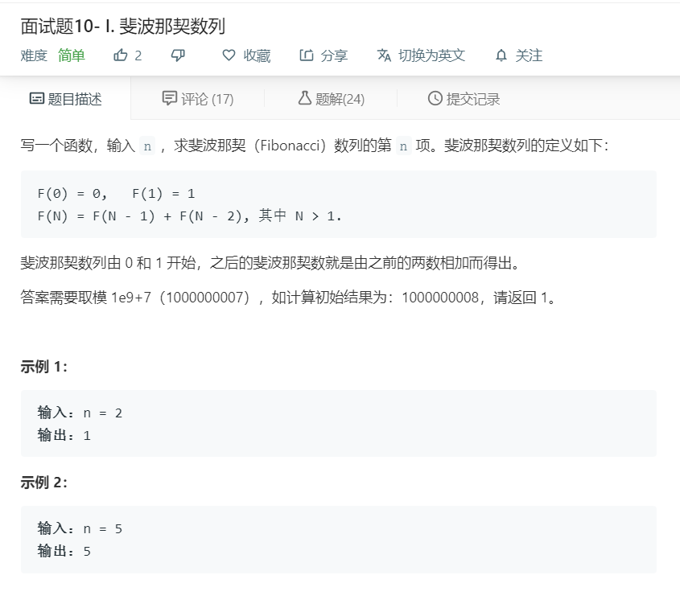

# 面试题10-1.斐波那契数列
  

```
/**
 * @param {number} n
 * @return {number}
 */
var fib = function(n) {
    if(n <= 1){
        return n;
    }

    let temp = [0,1];

    for(let i=2;i<=n;i++){
        let now = (temp[i-1] + temp[i-2])%1000000007;
        temp.push(now);
    }

    return temp.pop();
};
```