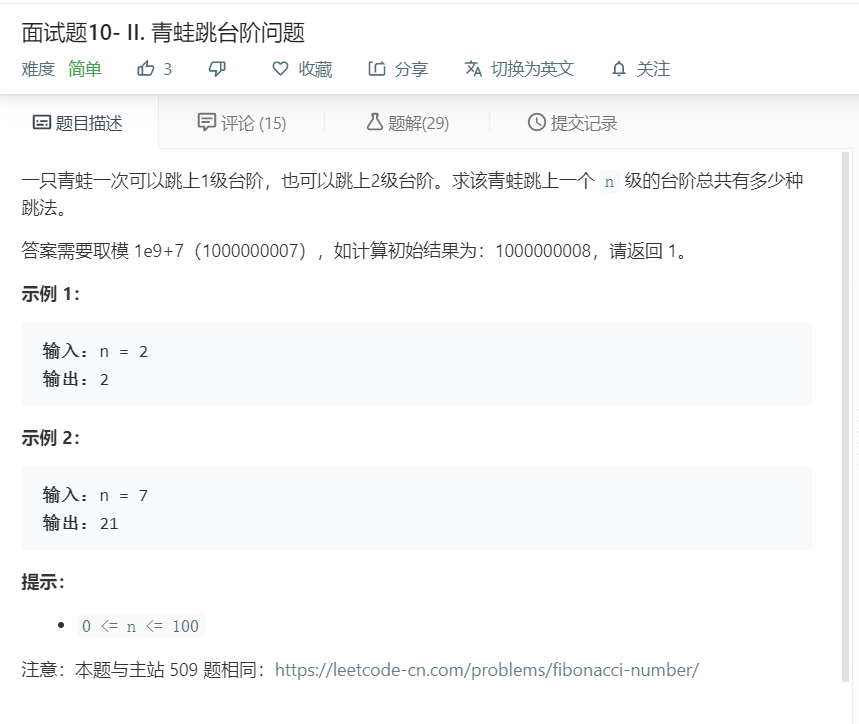

# 面试题10-II.青蛙跳台阶问题
  

```
/**
 * @param {number} n
 * @return {number}
 */
var numWays = function(n) {
    let temp = [1,2];
    if(n<=1){
        return 1;
    }
    for(let i=2;i<n;i++){
        let now = temp[i-1] + temp[i-2];
        temp.push(now%1000000007);
    }
    console.log(temp)
    return temp.pop();
};
```