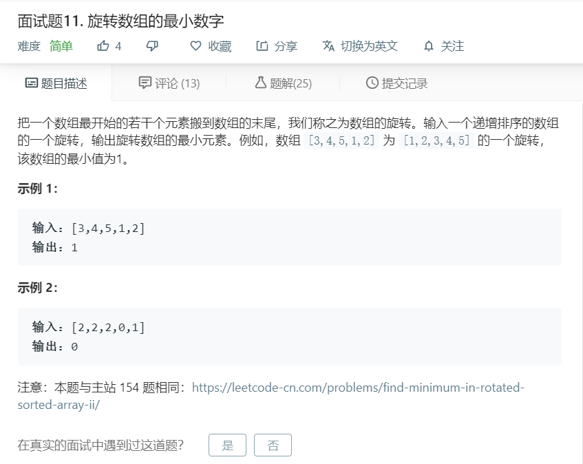

# 面试题11.旋转数组的最小数字
  

```
/**
 * @param {number[]} numbers
 * @return {number}
 */
var minArray = function(numbers) {
    for(let i=0;i<numbers.length-1;i++){
        if(numbers[i+1]<numbers[i]){
            return numbers[i+1];
        }
    }
    return numbers[0];
};
```