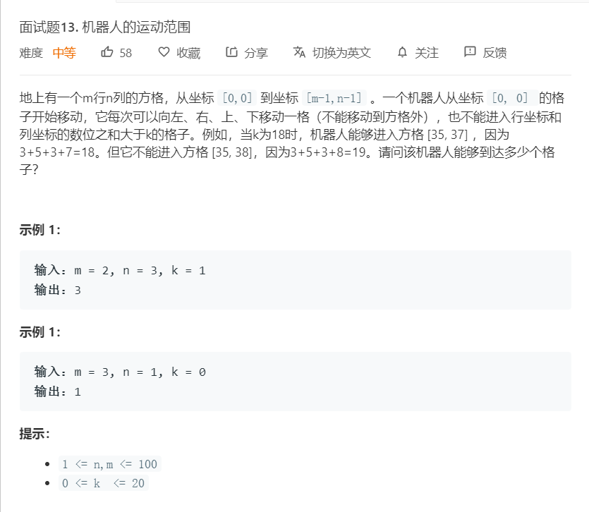

# 面试题13.机器人的运动范围
  

```
/**
 * @param {number} m
 * @param {number} n
 * @param {number} k
 * @return {number}
 */
var movingCount = function(m, n, k) {
    const result = [],tempone = [];

    let one = (i,j) => {
        let can = tempone.indexOf(i + '*' + j);

        let max = i % 10 + Math.floor(i / 10) + j % 10 + Math.floor(j / 10);
           
        if(i >= m || j >= n || max > k || can >= 0){
            return ;
        }else{
            console.log(i,j,max,i >= m , j >= n , max > k , can)
            result.push([i,j]);
            tempone.push(i + '*' + j);
            one(i+1,j);
            one(i,j+1);
        }
    }

    one(0,0);

    return result.length;
};
```