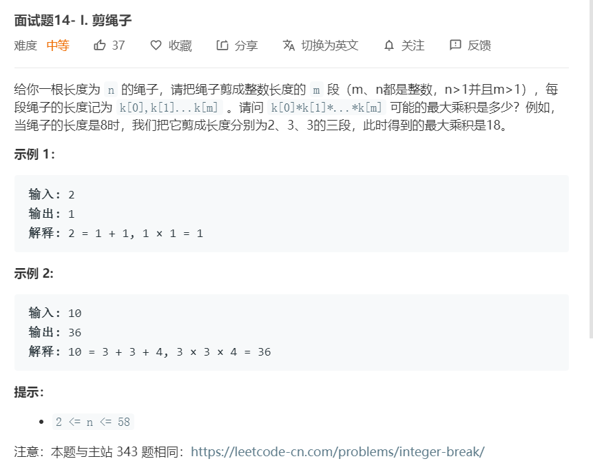

# 面试题14-I.剪绳子
  

```
/**
 * @param {number} n
 * @return {number}
 */
var cuttingRope = function(n) {
    let result = new Array(n+1).fill(1);

    for(let i = 3; i <= n ;i++){
        for(let j = 1;j < i;j++){
            result[i] = Math.max(result[i],j*(i-j),j*result[i-j]);
        }
    }

    return result[n];
};
```