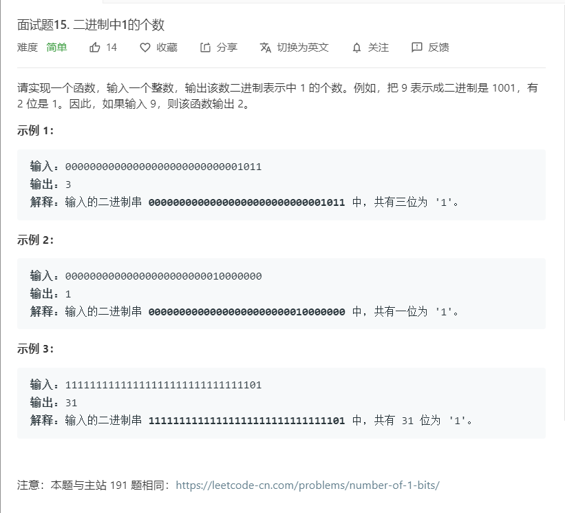

# 面试题15.二进制中1的个数
  

```
/**
 * @param {number} n
 * @return {number}
 */
var hammingWeight = function(n) {
    let temp = n.toString(2);
    let result = 0;
    temp = (temp + '').split('');
    temp.map((el)=>{
        if(el == '1'){
            result++;
        }
    })

    return result
};
```