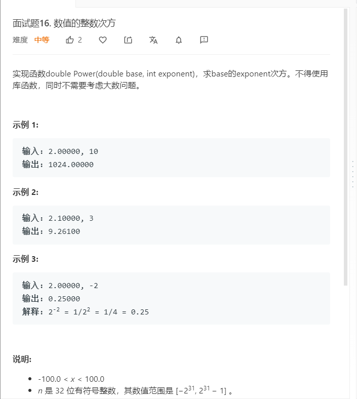

# 面试题16.数值的整数次方
  
```
/**
 * @param {number} x
 * @param {number} n
 * @return {number}
 */
var myPow = function(x, n) {
    if(x == 1){
        return x;
    }

    if(x == -1){
        if(n%2 == 0){
            return -x;
        }else{
            return x;
        }
    }
    if(n < 0){
        x = 1/x;
    }
    console.log(x);

    n = Math.abs(n);
    if(n>=2147483648){
        return x*0;
    }

    let temp = 1,mid = n >> 1;
    for(let i=0;i<mid;i++){
        temp *= x;
    }

    if(n/2 == mid){
        return temp*temp;
    }else{
        return temp*temp*x;
    }
};
```