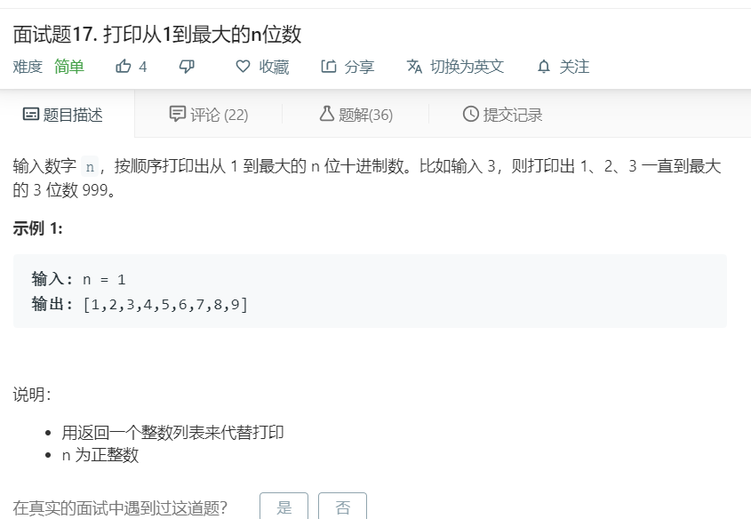

# 面试题17.打印从1到最大的n位数
  

```
/**
 * @param {number} n
 * @return {number[]}
 */
var printNumbers = function(n) {
    let temp = [];
    for(let i=0;i<n;i++){
        temp.push(9);
    }
    let result = +temp.join('');

    let need = [];
    for(let i=1;i<=result;i++){
        need.push(i);
    }

    return need;
};
```