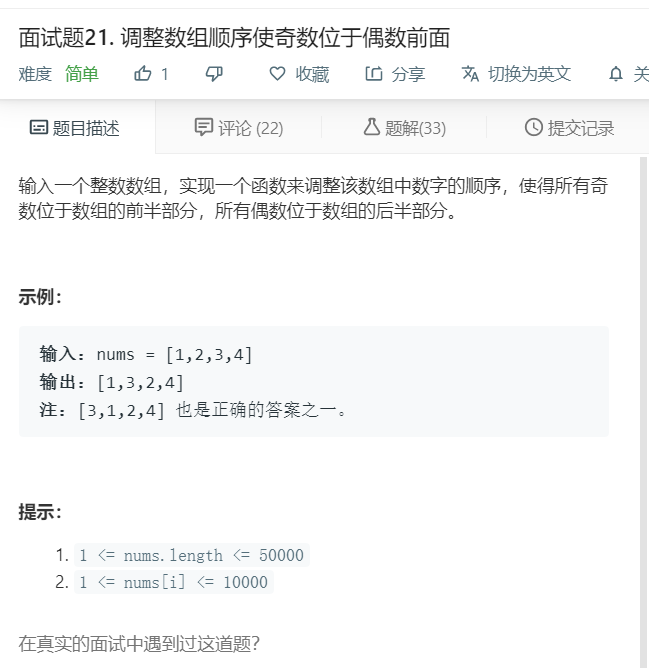

# 面试题21.调整数组顺序使奇数位于偶数前面
  

```
/**
 * @param {number[]} nums
 * @return {number[]}
 */
var exchange = function(nums) {
    let one = [],two = [];

    nums.forEach((el)=>{
        if(el % 2 != 0){
            one.push(el);
        }else{
            two.push(el);
        }
    })

    return one.concat(two);
};
```