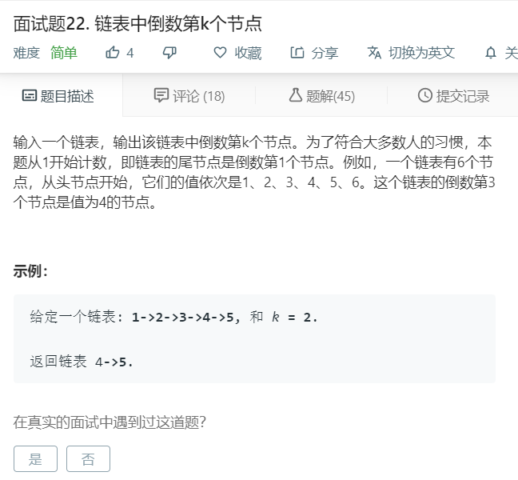

# 面试题22.链表中倒数第k个节点
  

```
/**
 * Definition for singly-linked list.
 * function ListNode(val) {
 *     this.val = val;
 *     this.next = null;
 * }
 */
/**
 * @param {ListNode} head
 * @param {number} k
 * @return {ListNode}
 */
var getKthFromEnd = function(head, k) {
    let temp = [];
    while(head){
        temp.push(head);
        head = head.next;
    }

    let who = temp.length - k;
    return temp[who];
};
```