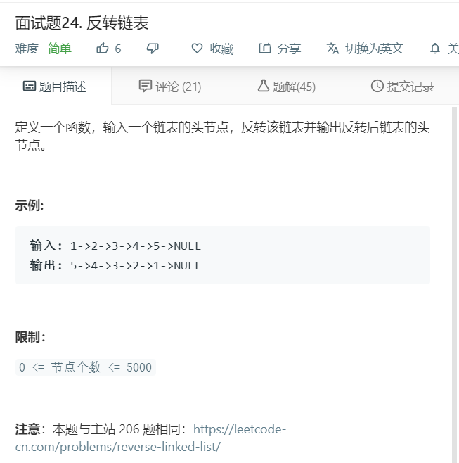

# 面试题24.反转链表
  

```
/**
 * Definition for singly-linked list.
 * function ListNode(val) {
 *     this.val = val;
 *     this.next = null;
 * }
 */
/**
 * @param {ListNode} head
 * @return {ListNode}
 */
var reverseList = function(head) {
    if(!head){
        return null;
    }
    let temp = [];
    while(head){
        temp.push(head);
        head = head.next;
    }

    temp.reverse();

    for(let i=0;i<temp.length-1;i++){
        temp[i].next = temp[i+1];
    }

    temp[temp.length-1].next = null;

    return temp[0];
};
```