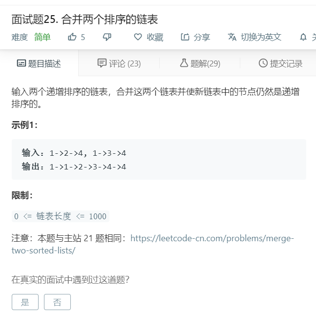

# 面试题25.合并两个排序的链表
  

```
/**
 * Definition for singly-linked list.
 * function ListNode(val) {
 *     this.val = val;
 *     this.next = null;
 * }
 */
/**
 * @param {ListNode} l1
 * @param {ListNode} l2
 * @return {ListNode}
 */
var mergeTwoLists = function(l1, l2) {
    if(!l1 && !l2){
        return null;
    }
    let temp = [];
    while(l1 && l2){
        if(l1.val < l2.val){
            temp.push(l1);
            l1 = l1.next;
        }else{
            temp.push(l2);
            l2 = l2.next;
        }
    }

    while(l1){
        temp.push(l1);
        l1 = l1.next;
    }

    while(l2){
        temp.push(l2);
        l2 = l2.next;
    }

    for(let i=0;i<temp.length-1;i++){
        temp[i].next = temp[i+1];
    }

    temp[temp.length-1].next = null;

    return temp[0];
};
```