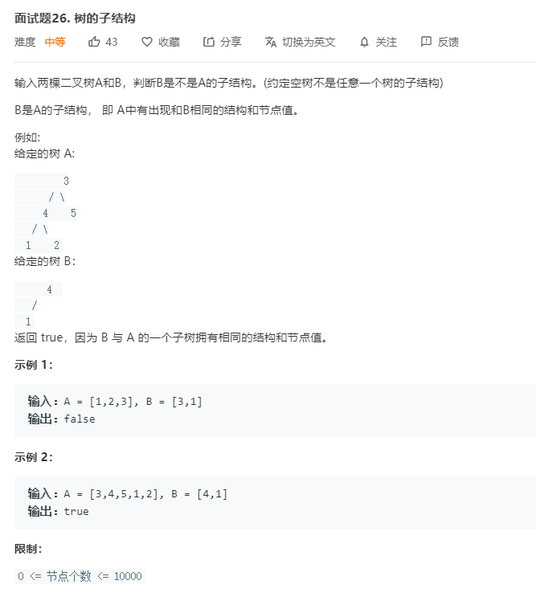

# 面试题26.树的子结构
  

```
/**
 * Definition for a binary tree node.
 * function TreeNode(val) {
 *     this.val = val;
 *     this.left = this.right = null;
 * }
 */
/**
 * @param {TreeNode} A
 * @param {TreeNode} B
 * @return {boolean}
 */
var isSubStructure = function(A, B) {
    if(!A || !B) {
        return false;
    }

    return isSubStructure(A.left,B) || isSubStructure(A.right,B) || mid(A,B);
};

const mid = (A,B) => {
    if(!B){
        return true;
    }

    if(!A) {
        return false;
    }

    return A.val == B.val && mid(A.left,B.left) && mid(A.right,B.right);
}
```