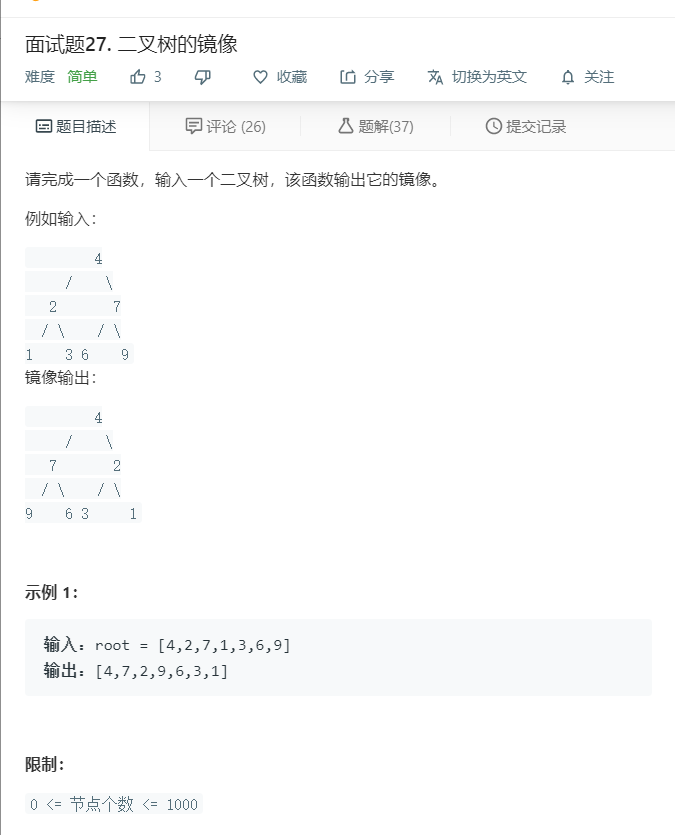

# 面试题27.二叉树的镜像
  

```
/**
 * Definition for a binary tree node.
 * function TreeNode(val) {
 *     this.val = val;
 *     this.left = this.right = null;
 * }
 */
/**
 * @param {TreeNode} root
 * @return {TreeNode}
 */
var mirrorTree = function(root) {
    if(!root){
        return null;
    }

    let one = (root) => {
        if(!root){
            return null;
        }
        [root.left,root.right] = [root.right,root.left];

        one(root.left);
        one(root.right);
    }

    one(root);
    return root;
};
```