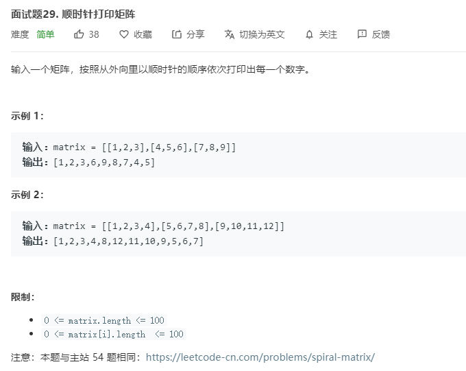

# 面试题29.顺时针打印矩阵
  

```
/**
 * @param {number[][]} matrix
 * @return {number[]}
 */
var spiralOrder = function(matrix) {
    if(matrix.length == 0) {
        return [];
    }
    let one = 0,two = 0,nn = matrix[0].length,mm = matrix.length;
    let result = [],n = nn, m = mm;

    while(result.length < nn*mm) {
        while(one < n) {
            result.push(matrix[two][one]);
            one++;
        }
        matrix.shift();
        if(matrix.length == 0) {
            break;
        }
        m = matrix.length;
        one = matrix[0].length - 1;

        while(two < m && matrix[two]) {
            result.push(matrix[two].pop());
            two++;
        }

        two = matrix.length - 1;
        one = matrix[0].length - 1;
        if(matrix[0].length == 0){
            break;
        }

        while(one >= 0) {
            result.push(matrix[two][one]);
            one--;
        }

        matrix.pop()
        two = matrix.length - 1;
        one = 0;

        while(two >= 0 && matrix[two]) {
            result.push(matrix[two].shift());
            two--;
        }

        one = 0;
        two = 0;
        if(matrix.length == 0) {
            break;
        }
        n = matrix[0].length;
        m = matrix.length;
        console.log(n,m)        
    }

    console.log(result);
    return result;
};
```