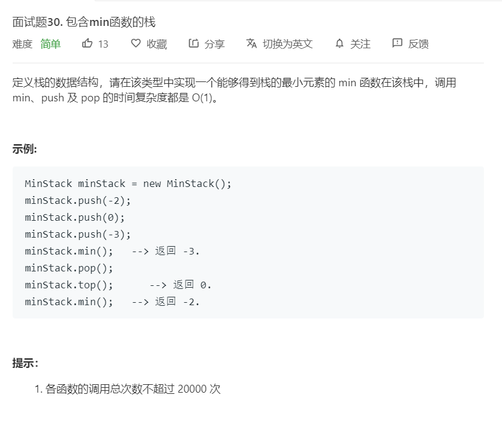

# 面试题30.包含min函数的栈
  

```
/**
 * initialize your data structure here.
 */
var MinStack = function() {
    this.temp = [];
};

/** 
 * @param {number} x
 * @return {void}
 */
MinStack.prototype.push = function(x) {
    this.temp = [...this.temp,x];
};

/**
 * @return {void}
 */
MinStack.prototype.pop = function() {
    let now = this.temp.splice(this.temp.length-1,1);
    return now;
};

/**
 * @return {number}
 */
MinStack.prototype.top = function() {
    return this.temp[this.temp.length-1];
};

/**
 * @return {number}
 */
MinStack.prototype.min = function() {
    let result = this.temp[0];
    this.temp.map((el)=>{
        if(el < result){
            result = el;
        }
    })

    return result;
};

/**
 * Your MinStack object will be instantiated and called as such:
 * var obj = new MinStack()
 * obj.push(x)
 * obj.pop()
 * var param_3 = obj.top()
 * var param_4 = obj.min()
 */
```